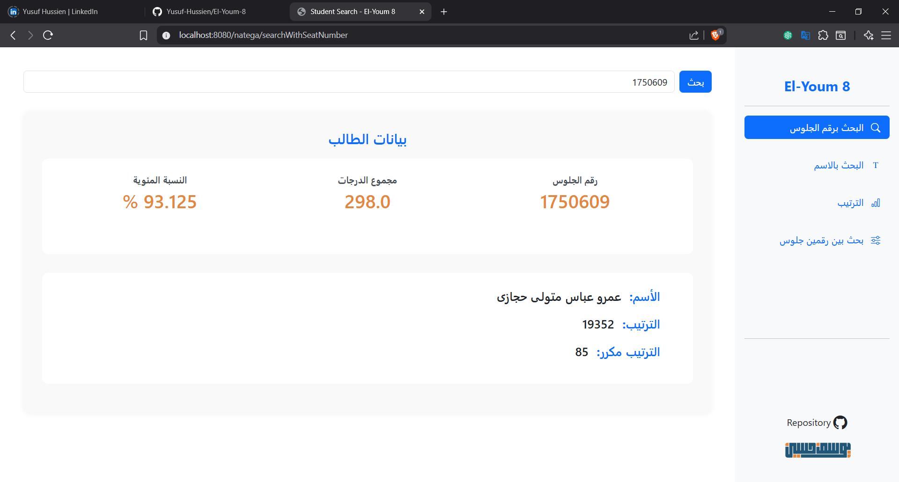
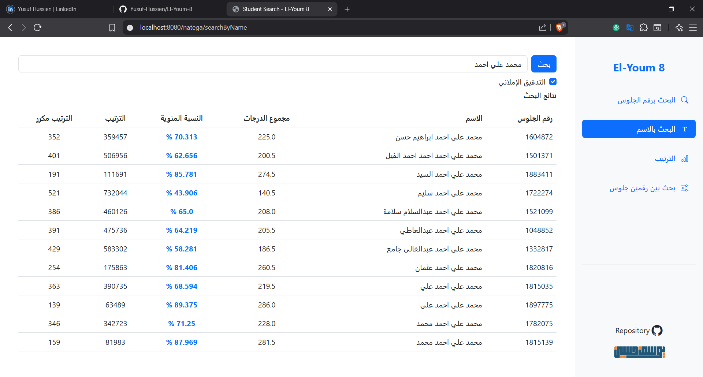
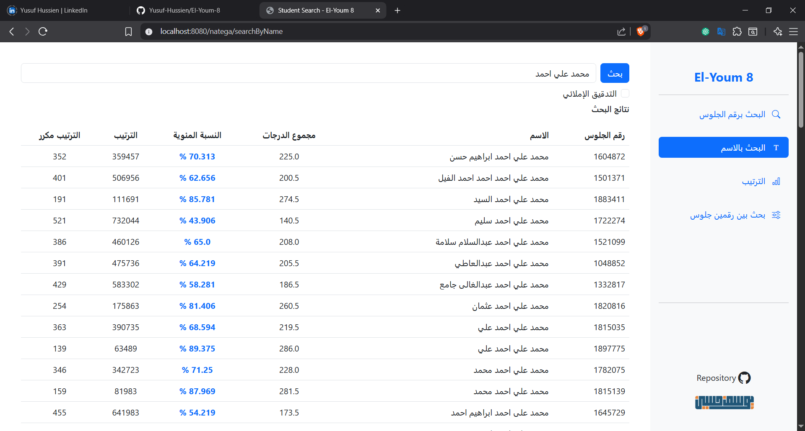
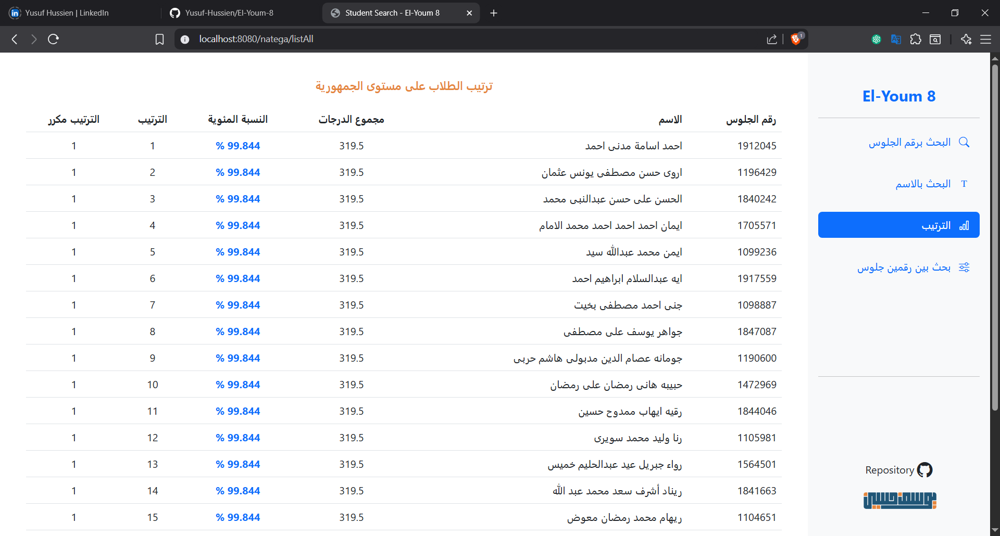
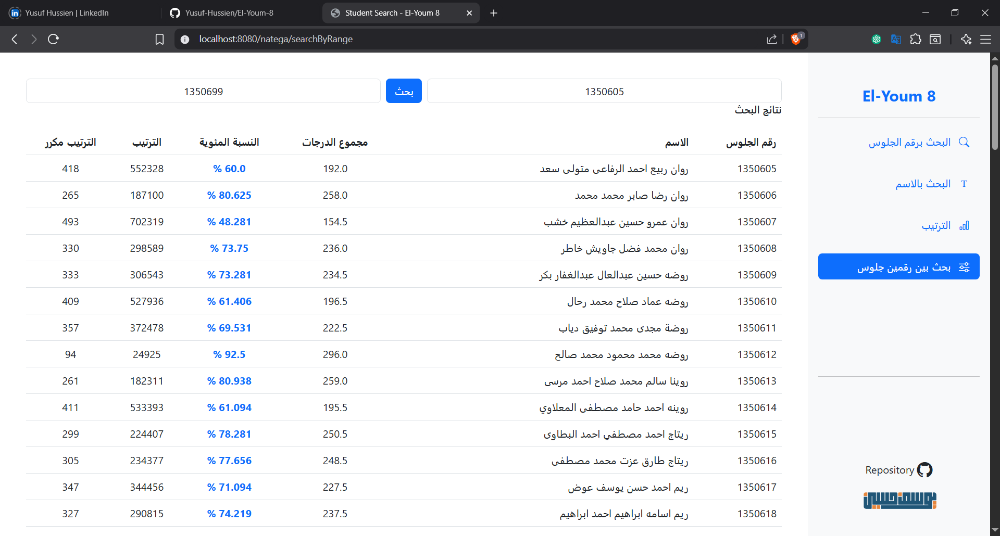
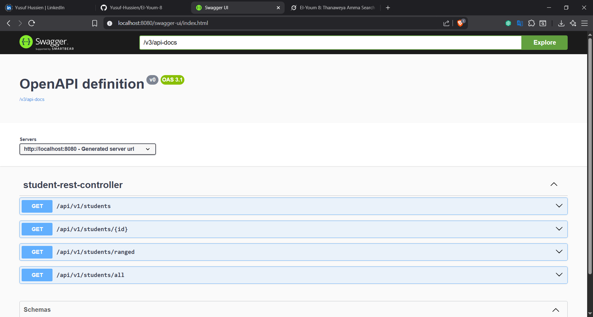

# El-Youm 8 🎓

**El-Youm 8** is a robust Spring Boot application designed to search Egypt's Thanaweya Amma (الثانوية العامة) results by **name**, particularly when the seat number (رقم الجلوس) is unknown. It features typo-tolerant name-based search, data ranking, and provides both a RESTful API and an MVC web interface for seamless user interaction.

---

## 🚀 Features

- 🔍 **Typo-Tolerant Search**: Search by name with flexible matching (e.g., handles variations like "ه/ة" or "ا/أ").
- 📊 **Calculated Fields**: Automatically computes rank, duplicated rank, and percentage.
- ⚡ **Optimized Querying**: Leverages indexes and composite indexes for fast searches.
- 🌐 **RESTful API**: Programmatic access to search functionality.
- 🖥️ **MVC Web Interface**: User-friendly interface built with Thymeleaf.
- 💥 **Robust Error Handling**: Comprehensive exception handling and form validation.
- 📦 **Efficient Data Migration**: Batch imports from Excel to the database with asynchronous insertions.
- 🐳 **Docker Support**: Run the application easily using Docker and Docker Compose.

---

## 🧠 Tech Stack

- **Java**: 21
- **Framework**: Spring Boot, Spring MVC
- **Frontend**: Thymeleaf
- **Concurrency**: ExecutorService (for async batch inserts)
- **Database**:  MySQL or (PostgreSQL supported)
- **Build Tool**: Maven
- **Containerization**: Docker & Docker Compose


---

## 🖼️ UI Previews

| Feature                           | Screenshot                                                                  |
|-----------------------------------|-----------------------------------------------------------------------------|
| Search by Seat Number             |            |
| Search by Name (With Spell Check) |  |
| Search by Name (No Spell Check)   |       |
| List All Results                  |                                      |
| Search in Range                   |                                |

---


## 📂 Project Structure

```
el-youm-8/
├── src/
│   ├── main/
│   │   ├── java/phi/elyoum8/           # Core Java source code
│   │   ├── resources/
│   │   │   ├── templates/              # Thymeleaf HTML templates
│   │   │   ├── static/                 # CSS, JS, and image assets
│   │   │   └── application.properties  # Configuration file
├── pom.xml                             # Maven dependencies
└── README.md                           # Project documentation
```

---

## 🛠️ Setup Instructions

### 1. Clone the Repository
```bash
git clone https://github.com/Yusuf-Hussien/El-Youm-8.git
cd El-Youm-8
```

### 2. Configure the Database
Create a database named `natega` in PostgreSQL (or MySQL). Update the `application.properties` file with your database credentials:

```properties
spring.datasource.url=jdbc:postgresql://localhost:5432/natega
spring.datasource.username=yourUsername
spring.datasource.password=yourPassword
spring.jpa.hibernate.ddl-auto=update
```

### 3. Run the Project
```bash
./mvnw spring-boot:run
```


### OR. Run with Docker (Recommended for Production)
```bash
docker-compose up --build
```


### 4. Data Import (Migration)
To import Thanaweya Amma results from an Excel sheet:
- The project includes logic for reading and batch-inserting data.
- Uses `ExecutorService` for asynchronous, high-performance insertions.
- Automatically calculates rank, percentage, and applies indexing during migration.

> **Note**: The dataset contains over 800,000 records. Ensure proper indexing for optimal performance.

---

## 🌍 API Endpoints

---

## 📝 Notes
- Ensure your database is running before starting the application.
- For large datasets, verify that your database is properly indexed to avoid performance bottlenecks.
- The REST API is ideal for integrating with external applications or scripts.

---

## 📧 Contact
For questions or feedback, reach out via the [GitHub Issues](https://github.com/Yusuf-Hussien/El-Youm-8/issues) page.
